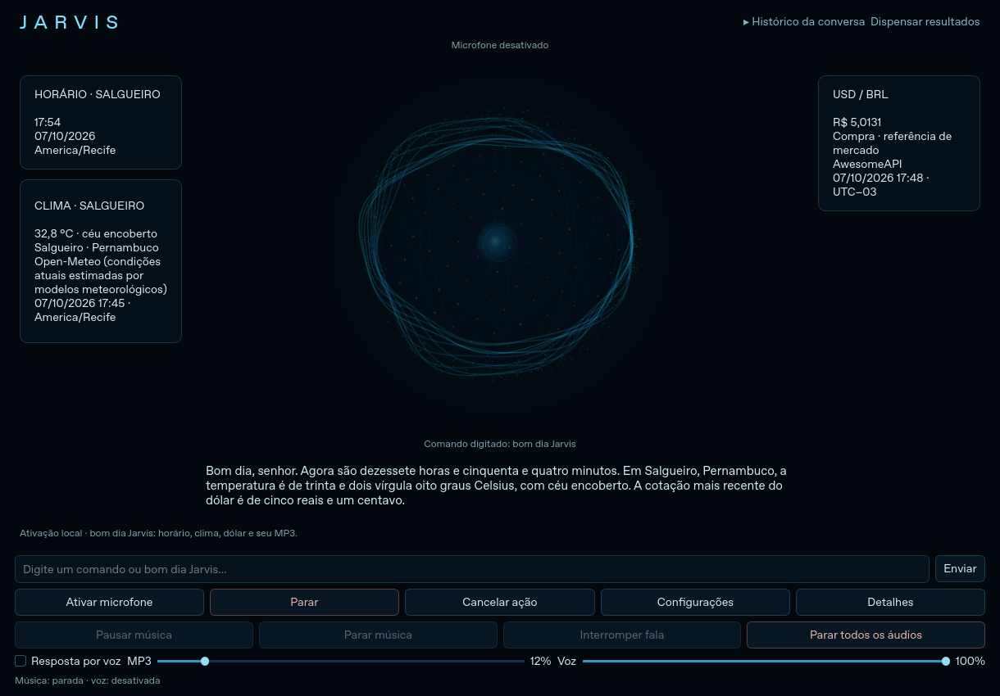

# Jarvis para Windows



Aplicação desktop em Python/PySide6 com fundo escuro, esfera azul procedural, filamentos, partículas e pequeno núcleo luminoso. As duas imagens fornecidas foram observadas: o contorno orgânico inspira a esfera, e as linhas finas da outra referência inspiram os cartões simplificados. A esfera reage ao áudio capturado e, no Windows, ao PCM da voz enviado ao player. Não há imagem ou vídeo de fundo.

O reconhecimento Whisper é local. Arquivos, aplicativos, Google, áudio e Spotify continuam funcionando **sem OpenAI, chave ou assinatura**. Conversa livre pode usar Ollama no próprio PC ou a integração OpenAI opcional, escolhida explicitamente nas Configurações. O padrão permanece local; a saudação não depende de IA.

- **“Jarvis, pesquise como fazer um currículo”**: abre os resultados do Google no navegador padrão, sem IA.
- **“Jarvis, abra o Spotify”**: comando local, sem OpenAI.
- **“Jarvis, explique uma função de segundo grau”**: conversa livre pelo Ollama local, se instalado/configurado.
- **“Jarvis”**: responde “Sim, senhor?” e espera a pergunta. O prazo e a duração máxima da captura são configuráveis.
- **“bom dia Jarvis”**: tem prioridade depois de concluir a frase; música local, clima, horário de Recife e dólar. Funciona **sem chave da OpenAI**.
- Perguntas por texto funcionam no painel e no terminal. “Limpar conversa” remove o contexto local desta sessão; não apaga dados do serviço externo.

O MP3 local toca na saudação; o Spotify tem integração separada, descrita em Controle do PC. O reconhecimento permanece pausado enquanto o próprio Jarvis fala ou toca música. O botão **Parar** desativa o microfone, interrompe áudios e descarta resultados cancelados. Uma chamada de rede ou inferência já em andamento pode terminar até seu timeout; não aparecerá como resposta depois do cancelamento.

## 1. Preparar o Python

Recomendado: **Windows 10/11, Python 3.11 de 64 bits**, microfone e alto-falante/fone. Instale o Python pelo [site oficial](https://www.python.org/downloads/windows/), incluindo o Python Launcher (`py`).

Abra o **PowerShell** na pasta do projeto, onde estão `main.py` e `requirements.txt`. Se necessário, use `cd "C:\caminho\para\J.A.V.I.S"`, substituindo pelo seu caminho real. Execute:

```powershell
py -3.11 -m venv .venv
.\.venv\Scripts\python.exe -m pip install --upgrade pip
.\.venv\Scripts\python.exe -m pip install -r requirements.txt
```

Os comandos usam diretamente o Python do ambiente virtual. Não é necessário ativá-lo nem alterar a política de execução do PowerShell. Internet é necessária para instalar dependências e baixar o modelo; depois, reconhecimento e síntese funcionam localmente.

Se já tem o ambiente da versão anterior, **não recrie a pasta `.venv`**. Execute apenas o comando de instalação com `-r requirements.txt` para incluir as novas dependências de interface, ferramentas e integração Windows. Use Python **3.11 x64**, como na versão que já funcionou; Python 3.14 não é suportado por estas versões de dependências.

## 2. Abrir o painel

Depois de instalar, dê dois cliques em **`iniciar_jarvis.bat`**, ou execute na pasta do projeto:

```powershell
.\.venv\Scripts\python.exe main.py
```

O microfone começa **desativado**. Digite `bom dia Jarvis` e clique em **Enviar** para testar. O relógio usa `America/Recife`. Clima e dólar são consultados em paralelo: cada cartão aparece assim que sua consulta termina, com fonte, atualização e indisponibilidade quando necessário. Os valores da captura acima são apenas um registro daquela consulta, não dados fixos do aplicativo.

A esfera ocupa o centro; frase reconhecida e resposta atual ficam abaixo. Respostas aceitam Markdown seguro e rolagem. **Histórico da conversa**, no cabeçalho fixo, abre a conversa completa desta sessão, inclusive avisos. **Dispensar resultados** recolhe cartões/resposta sem apagar o histórico. Uma nova consulta mostra seus novos resultados. A busca de arquivos mostra uma lista: clique em um resultado para solicitar a abertura pela camada de permissões existente. O cartão musical usa título/artista do MP3 quando disponíveis; sem tags, mostra o nome do arquivo e informa que o artista não foi fornecido. Spotify exibe os dados retornados pela API/sessão do Windows.

O botão **Detalhes** abre lista/atualização/teste de microfones, medidor RMS capturado, diagnóstico, permissões do PC, limpeza e controles do Spotify. **Configurações** permite ajustar voz instalada, velocidade, MP3, volumes, Whisper, limiar, duração/espera da pergunta, reduzir movimento e provedor de conversa. A enumeração roda fora da thread da interface. Preferências ficam em `config.local.json`, sem credenciais. Ao aplicar configurações, ative o microfone novamente quando desejar.

A barra inferior mantém texto, microfone, cancelamento e controles de áudio acessíveis durante as consultas. Em janelas menores, a esfera diminui inteira e os cartões passam para baixo, com rolagem vertical. **Reduzir movimento** mantém o núcleo estável, sem expansão/raios/transições; a intensidade ainda reflete o áudio. Minimizar pausa o desenho animado e as transições, sem interromper as consultas. A palavra de ativação é inteira: `jarvisinho` não ativa. Aguarde três segundos depois de uma sequência por voz para evitar duplicatas.

## Usar sem OpenAI e sem assinatura

Você **não precisa configurar OpenAI nem pagar assinatura** para os comandos do PC. Em **Configurações → Conversa livre**, mantenha **Local / Ollama (padrão)**. Uma chave antiga no `.env` não ativa a OpenAI automaticamente. A mesma preferência vale para o modo texto.

Exemplos locais: “Jarvis, abra o Google”, “Jarvis, pesquise notícias de Salgueiro”, “Jarvis, encontre o arquivo relatório”, “Jarvis, abra este PDF”, “Jarvis, abra o Spotify” e “Jarvis, coloque o volume em cinquenta por cento”. Digite “ajuda” para ver exemplos. Horário, “qual a cotação do dólar?” e “como está o clima em Salgueiro?” também consultam suas fontes sem IA. O reconhecimento continua local e pede a palavra Jarvis para comandos falados; o campo de texto aceita com ou sem essa palavra. “Bom dia Jarvis” mantém prioridade.

A pesquisa abre uma página no **navegador padrão**. O termo é enviado ao Google quando o navegador acessa a página; o Jarvis não lê automaticamente resultados, não os resume e não afirma ter verificado seu carregamento. Internet continua necessária para Google, câmbio, clima e serviços do Spotify. Os comandos de arquivos/aplicativos e o resumo básico funcionam sem um modelo de IA. Não existe envio contínuo de áudio nem de comandos à OpenAI.

A interpretação usa frases previstas, não uma IA: um pedido por vez, nos formatos da tabela abaixo. Não promete compreender qualquer formulação. No modo local, se um comando não for identificado, não executa shell nem encaminha à OpenAI. Converse no modelo local opcional ou reformule seguindo um exemplo. Excluir/sobrescrever e ler documentos continuam exigindo consentimento específico.

### IA local opcional para conversa e explicação

O resumo básico seleciona frases do documento usando palavras frequentes. É um **resumo extrativo**, não uma explicação gerada por IA. Para “explique este PDF” e perguntas livres, configure um modelo generativo local:

1. Instale [Ollama para Windows](https://ollama.com/download/windows), do site oficial. Não precisa de chave OpenAI. Instale no seu PC, não neste ambiente de desenvolvimento.
2. Depois de instalar, abra um novo terminal e baixe um modelo **local**, por exemplo:

   ```powershell
   ollama pull qwen2.5:3b
   ```

   O download inicial exige internet, espaço em disco e memória para o modelo. O desempenho depende do seu hardware; PCs mais modestos podem testar `qwen2.5:1.5b`. Configure o mesmo nome baixado no passo seguinte. Não escolha modelos de nuvem para este fluxo local.
3. Abra o `.env` existente na pasta do Jarvis com `notepad .env`. Se ainda não existir, crie-o. Acrescente sem apagar a configuração Spotify:

   ```dotenv
   OLLAMA_MODEL=qwen2.5:3b
   ```

4. Mantenha Ollama aberto e reinicie o Jarvis. Teste “Jarvis, explique o que é Python”. Se Ollama não iniciar automaticamente, use `ollama serve` em outro terminal; se a porta já estiver ocupada pelo Ollama, não abra outro servidor.

O cliente usa somente `http://127.0.0.1:11434/api/chat`, sem redirecionamentos ou fallback externo, com timeout de conexão de 3 s e leitura de 60 s. O modelo recebe texto e até seis pares de conversa, sem áudio. Conteúdo de documento só é lido depois da sua confirmação e não fica no contexto das perguntas posteriores. Saídas do modelo são texto: **não têm autoridade para executar ferramentas**. Não há necessidade de Ollama para pesquisar Google ou controlar o PC. O README oficial do Ollama foi consultado; o modelo não foi baixado/executado neste ambiente e sua qualidade/velocidade devem ser validadas no seu computador.

### OpenAI opcional, preservada

Se quiser voltar à integração de conversa com OpenAI:

1. No `.env` **local** existente, preserve as outras configurações e acrescente `OPENAI_API_KEY=sua_chave` e, opcionalmente, `OPENAI_MODEL=gpt-4.1-mini`. Nunca publique esse arquivo nem compartilhe a chave em mensagens.
2. Reinicie o Jarvis. Em **Configurações → Conversa livre**, escolha **OpenAI (opcional)** e salve.
3. Teste uma pergunta geral por texto. A API precisa de internet e saldo/cobrança próprios; assinatura ChatGPT não é crédito de API. Erros de chave, saldo ou conexão aparecem no painel.

Com essa escolha, perguntas gerais e até seis pares de contexto textual podem ser enviados à OpenAI. A ativação Whisper e os comandos locais conhecidos continuam no PC; a saudação usa suas APIs de clima/câmbio diretamente. Documentos são resumidos localmente ou explicados pelo Ollama mediante consentimento, sem enviar seu conteúdo à OpenAI. **Local / Ollama** nunca tenta OpenAI como alternativa automática. Não é preciso ativar esta opção para usar o restante do Jarvis.

## Testar primeiro sem microfone

Instale uma voz **Português (Brasil)** nas configurações de idioma/fala do Windows. No Windows 11, procure **Configurações → Hora e idioma → Fala → Gerenciar vozes → Adicionar vozes**. Os nomes dos menus variam conforme a versão. O projeto usa as vozes locais **SAPI5**, acessíveis ao Python; algumas vozes “naturais” exclusivas de outros aplicativos podem não aparecer. Reinicie o Jarvis depois da instalação.

```powershell
.\.venv\Scripts\python.exe main.py --texto
```

Digite `bom dia Jarvis` e pressione Enter. O Jarvis executa a sequência de música, consultas e fala. Digite `sair` ou use Ctrl+C para encerrar. Esse modo não carrega Whisper nem abre o microfone. Para testar só horário, consultas e terminal, **sem nenhum áudio**:

```powershell
.\.venv\Scripts\python.exe main.py --texto --sem-voz --sem-musica
```

Os dados nunca são inventados. Quando um serviço falha, o Jarvis informa o horário e os dados disponíveis, acrescentando um aviso para o serviço indisponível. A mensagem da cotação continua sendo:

> Bom dia, senhor. Não consegui consultar a cotação do dólar agora. Tente novamente em instantes.

Na saudação completa, “Bom dia, senhor” aparece uma só vez. Uma falha do clima não impede a cotação, e uma falha da cotação não impede o clima.

## Música local

Coloque seu arquivo, obtido legitimamente, em:

```text
J.A.V.I.S/
  assets/
    highway_to_hell.mp3
```

**O projeto não inclui nem baixa a música.** O MP3 é ignorado pelo Git. Se estiver ausente, inválido ou a saída de áudio falhar, haverá um aviso no terminal e a saudação continuará.

Para mudar o caminho e o volume:

```powershell
.\.venv\Scripts\python.exe main.py --texto --musica "C:\Musicas\highway_to_hell.mp3" --volume 0.15
```

O volume vai de `0` (mudo) a `1` (máximo); o padrão é `0.12`, ou 12%. Durante a fala, cai para 35% do volume escolhido, limitado a 8% do máximo. Após a resposta completa, o volume reduz gradualmente por até 1,5 segundo até parar. A música toca em paralelo às consultas e à voz; não é necessário esperar a faixa inteira. Não há repetição automática da faixa.

Para executar sem música, use `--sem-musica`. **`--sem-voz` desativa somente a fala**, preservando a música. O caminho padrão é relativo à pasta do projeto; um caminho personalizado relativo é resolvido a partir da pasta onde você executa o comando.

## 3. Modelo de reconhecimento local

Usamos **Whisper multilíngue**, executado no próprio PC pelo [faster-whisper](https://github.com/SYSTRAN/faster-whisper), sem enviar áudio a um serviço externo. O modelo padrão é `tiny`, com pesos de aproximadamente 75 MB, disponível em [Systran/faster-whisper-tiny](https://huggingface.co/Systran/faster-whisper-tiny). Reserve algumas centenas de MB para modelo e dependências e, de preferência, ao menos 4 GB de RAM no PC. Não precisa de placa de vídeo: usamos CPU e cálculo `int8`.

A primeira transcrição baixa o modelo automaticamente para `modelos/`. Durante o download, a captura permanece fechada; a velocidade depende da internet. Depois os arquivos são reutilizados. Se quiser preparar o modelo antes, sem abrir o microfone, execute **na pasta do projeto**:

```powershell
.\.venv\Scripts\python.exe -c "from faster_whisper import WhisperModel; WhisperModel('tiny', device='cpu', compute_type='int8', cpu_threads=2, download_root='modelos'); print('Modelo pronto.')"
```

O reconhecimento funciona sem internet depois que todos os arquivos do modelo estiverem disponíveis; câmbio e clima continuam exigindo internet. Para garantir que não haja sequer uma tentativa de atualizar o modelo em rede durante a execução, depois do download você pode definir `$env:HF_HUB_OFFLINE='1'` no PowerShell. Para voltar a permitir downloads: `Remove-Item Env:HF_HUB_OFFLINE`.

Fale com clareza, em ambiente silencioso, e faça uma pausa de cerca de um segundo ao terminar a frase. A qualidade e o tempo da transcrição dependem do microfone e do processador. O modelo `base` é maior e pode melhorar a precisão; use `--modelo base` para baixá-lo e selecioná-lo. Uma pasta local de modelo convertido para faster-whisper também pode ser informada.

## 4. Executar com microfone

```powershell
.\.venv\Scripts\python.exe main.py
```

Na janela, clique **Ativar microfone**. Fique em silêncio por um segundo durante a calibração e aguarde o estado **Ouvindo**. A primeira transcrição pode demorar para baixar/carregar o modelo. Você pode dizer “Jarvis, explique uma função”, apenas “Jarvis” para ouvir “Sim, senhor?”, ou “bom dia Jarvis” para a saudação prioritária.

Diga **“bom dia Jarvis”**. Espere a resposta terminar e pelo menos três segundos antes de uma nova ativação. Maiúsculas, espaços, acentos e pontuação são normalizados. Só frases completas transcritas acionam a consulta. A captura usa blocos curtos, detecta volume e encerra a frase após um segundo de silêncio ou a duração máxima configurada (padrão: 12 segundos de áudio). Um filtro local de atividade de voz também ajuda a descartar silêncio.

O microfone é fechado antes da transcrição e permanece fechado durante **toda** a sequência: música, consultas, fala e redução final do volume. Só é reaberto após todos os áudios terminarem. O áudio anterior é descartado. Há uma janela de três segundos após a sequência para evitar ativações duplicadas. O worker executa uma operação por vez, sem sobrepor músicas ou respostas, e não mantém escuta depois de encerrado. Na janela use Parar; no terminal, Ctrl+C.

Ctrl+C interrompe a fala e a música, incluindo durante a redução do volume. Se houver uma consulta em andamento, os áudios são interrompidos imediatamente, mas o processo pode levar alguns segundos para terminar enquanto a requisição em outra thread atinge seu timeout.

### Velocidade, modelo e dispositivo

```powershell
.\.venv\Scripts\python.exe main.py --velocidade 150
.\.venv\Scripts\python.exe main.py --modelo base
```

A velocidade padrão da versão desktop é 150; aceita de 80 a 300. Listar dispositivos de áudio:

```powershell
.\.venv\Scripts\python.exe -c "import sounddevice as sd; print(sd.query_devices())"
```

Use o índice de um dispositivo com entrada de áudio:

```powershell
.\.venv\Scripts\python.exe main.py --microfone 1
```

Listar vozes que o Python consegue usar:

```powershell
.\.venv\Scripts\python.exe -c "import pyttsx3; e=pyttsx3.init('sapi5'); [print(v.id, v.name, v.languages) for v in e.getProperty('voices')]; e.stop()"
```

O Jarvis prioriza português brasileiro; se só houver outra voz portuguesa, usará essa voz. Para escolher explicitamente, copie um identificador da lista:

```powershell
.\.venv\Scripts\python.exe main.py --texto --voz "IDENTIFICADOR_DA_VOZ" --velocidade 150
```

## Horário, clima e fontes

**Horário:** o Jarvis usa `ZoneInfo("America/Recife")`, com `tzdata` instalado para Windows. Usa o relógio do PC como referência e converte para o fuso de Salgueiro independentemente do fuso escolhido no Windows. Mantenha a data/hora do PC sincronizada. Fala horas/minutos por extenso, incluindo “uma hora”, “duas horas”, “meio-dia” e “meia-noite”. O horário é calculado imediatamente antes de montar a resposta, após as consultas.

**Clima:** [Open-Meteo](https://open-meteo.com/en/docs), API pública sem chave para uso pessoal não comercial. A cada ativação:

1. Consulta a [API de geocodificação](https://open-meteo.com/en/docs/geocoding-api) e seleciona a **cidade** `Salgueiro`, estado `Pernambuco`, país `BR`, fuso `America/Recife`. Exclui aeroporto e localidades homônimas. A consulta real confirmou a cidade em latitude **−8,07417** e longitude **−39,11917**.
2. Usa essas coordenadas na API `https://api.open-meteo.com/v1/forecast`, solicitando **`current=temperature_2m,weather_code`**, em Celsius. Apesar do nome `forecast` no endereço, utiliza os campos de condições **atuais**, sem consultar máximas, mínimas ou previsão diária.
3. Valida localização da célula da grade, unidades, temperatura, código WMO e timestamp. Códigos são traduzidos para português. Dados com mais de **90 minutos** ou mais de **5 minutos no futuro** são rejeitados; não são apresentados como clima atual. Nenhum dado em cache é usado como reserva.

As condições atuais do Open-Meteo são **estimativas de modelos meteorológicos**, baseadas em dados de intervalos de 15 minutos; não são uma medição direta de termômetro/estação em Salgueiro. O horário exibido é o instante meteorológico representado em `current.time`, não o momento em que baixamos a resposta nem o horário de emissão do modelo. A célula da grade pode diferir um pouco das coordenadas centrais da cidade.

O terminal exibe cidade/estado/país confirmados, coordenadas, temperatura, condição traduzida, fonte e data/hora dos dados em `America/Recife`. Temperatura é pronunciada com até uma casa decimal, arredondada pelo critério comercial. O timestamp Unix é interpretado em UTC e convertido para Recife.

**Consultas paralelas:** dólar e clima são executados em duas threads. Confirmar a cidade e buscar o clima são etapas sequenciais da thread meteorológica. Câmbio mantém timeout de conexão de 5 segundos e leitura de 10; cada requisição de clima/geocodificação usa 3 e 5 segundos. Esses limites restringem conexão e espera pela leitura, não um prazo absoluto de toda a sequência. HTTPS e verificação de certificados permanecem habilitados.

## Cotação e privacidade

- Fonte: **AwesomeAPI**, [documentação pública de moedas](https://docs.awesomeapi.com.br/api-de-moedas).
- Requisição: `GET https://economia.awesomeapi.com.br/json/last/USD-BRL` a cada ativação aceita, sem cache ou valor de reserva.
- Campo usado: **`bid` (compra)** do par `USDBRL`. É uma referência de mercado, não o preço final que um banco cobra ao vender dólar. Spread, IOF e tarifas não são calculados.
- O terminal mostra o valor original, fonte, tipo e data/hora da fonte. O campo Unix `timestamp` é convertido para horário de Brasília (UTC−03:00); a data é comparada com o dia atual nesse fuso.
- A voz arredonda para dois centavos decimais pelo critério comercial (`ROUND_HALF_UP`) e fala reais e centavos por extenso. Se a fonte não tiver atualização do dia, também fala a data da última atualização. Isso pode acontecer em fins de semana/feriados. O programa não inventa uma cotação atual nem afirma ser uma taxa garantida para negociação.
- HTTPS e verificação TLS permanecem habilitados; há timeout de conexão de 5 segundos e de leitura de 10 segundos. Respostas HTTP inesperadas, JSON inválido, moeda errada, valores não positivos/não finitos e datas inválidas são tratados como falha. O timeout de leitura limita a espera por dados, não um prazo absoluto de toda a execução.
- Internet é necessária **para câmbio e clima**. Nenhum áudio é enviado às APIs ou a um serviço de reconhecimento. Pequenos blocos de áudio ficam temporariamente em memória e são descartados; não são criados arquivos de gravação. A música é lida somente do arquivo local indicado.

## Problemas comuns

**Microfone/permissão:** no Windows, habilite acesso ao microfone para aplicativos da área de trabalho em Configurações → Privacidade e segurança → Microfone. Confira o dispositivo padrão e se outro programa o está usando exclusivamente. Se o dispositivo falhar ou for desconectado, a escuta é desativada com aviso; reconecte, atualize a lista, selecione e clique em Ativar microfone novamente. Falhas das consultas não desativam a escuta. O botão Parar continua disponível.

**Modelo não carrega:** confira a internet no primeiro uso e a pasta `modelos/`. Se usar `--modelo` com um caminho, ele deve conter um modelo convertido para faster-whisper, com `model.bin`, `config.json` e demais recursos. Não use um modelo Vosk nem um arquivo ZIP.

**Erro de DLL na instalação/execução:** se aparecer `DLL load failed`, confira se Python e Windows são de 64 bits e instale o [Microsoft Visual C++ Redistributable x64](https://aka.ms/vs/17/release/vc_redist.x64.exe), pelo site da Microsoft. Reinicie o terminal e tente novamente.

**Não reconhece Jarvis:** use um ambiente silencioso e uma pausa após a frase. Confira primeiro `--texto`, que testa câmbio e fala independentemente do reconhecimento. Para voz baixa, tente `--limiar 0.005`; se o ruído disparar capturas, tente `--limiar 0.03`. O piso padrão é `0.01` (RMS relativo, de 0 a 1); a detecção usa o maior entre esse piso e 2,5 vezes o ruído calibrado. Também pode tentar `--modelo base`. A entrada usa uma taxa e um número de canais verificados no dispositivo; o PCM float32 é convertido em memória para mono a 16 kHz antes do Whisper. Normalizar o texto não corrige palavras transcritas incorretamente.

**Sem voz/som:** instale uma voz portuguesa compatível com SAPI5, confira a lista de vozes, o volume e a saída padrão. Falhas de síntese são informadas no terminal; o programa continua e tenta iniciar a voz novamente na próxima ativação.

**Sem cotação:** confira internet, relógio do PC e acesso a `economia.awesomeapi.com.br`. HTTP 429 indica limite de consultas; aguarde antes de tentar de novo. Não desative a verificação de certificados. A frase de falha é falada quando uma voz funcional está disponível; também aparece no terminal.

**Sem clima:** confira o relógio do PC e o acesso a `geocoding-api.open-meteo.com` e `api.open-meteo.com`. Localização ambígua, resposta inválida ou dados antigos resultam em indisponibilidade; dólar e horário continuam funcionando.

**Sem música:** confira se o nome é `assets/highway_to_hell.mp3` (não `.mp3.mp3`), se o arquivo é um MP3 válido e se a saída de áudio funciona. Ajuste `--volume` se necessário. Use `--sem-musica` para isolar o teste da voz.

## Organização e testes

```text
main.py                 entrada do programa
jarvis/app.py           funções legadas da versão de terminal
jarvis/interface.py     janela PySide6, cartões e controles
jarvis/esfera.py        desenho procedural e envelope de áudio
jarvis/audio_voz.py     reprodução PCM em memória e amplitude no tempo DAC
jarvis/runtime.py       worker serial e sinais para a interface
jarvis/cliente_local.py roteamento local, resumo e Ollama opcional
jarvis/comandos_locais.py frases previstas e parâmetros
jarvis/cliente_openai.py integração opcional Responses API
jarvis/comandos.py      prioridade e ativação por palavra inteira
jarvis/configuracoes.py preferências locais sem segredos
jarvis/terminal.py      teste de conversa e saudação por texto
jarvis/reconhecimento.py reconhecimento local e normalização
jarvis/cotacao.py        API, validação, data e valor por extenso
jarvis/clima.py          cidade, condições atuais e tradução WMO
jarvis/horario.py        fuso America/Recife e horário por extenso
jarvis/saudacao.py       resposta única e falhas parciais
jarvis/musica.py         reprodução, volume e redução final
jarvis/voz.py            voz local e velocidade
assets/                 coloque seu MP3 local aqui
tests/                  testes sem hardware e sem consultas externas
requirements.txt        dependências diretas com versões fixadas
```

Rodar os testes automatizados, sem instalar dependência adicional:

```powershell
.\.venv\Scripts\python.exe -m unittest discover -s tests -v
```

Os testes usam respostas de rede e áudio **simulados**, e widgets Qt reais com plataforma offscreen; isso verifica lógica e recuperação de falhas, não qualidade de reconhecimento, alto-falante nem disponibilidade real da API. As dependências diretas estão fixadas, mas este projeto ainda não tem um lockfile de dependências transitivas.

### Validação no ambiente de criação

O ambiente de criação é Linux, sem acesso ao seu microfone ou alto-falantes do Windows. As consultas HTTPS **reais** de geocodificação, clima atual e câmbio e a documentação do Open-Meteo foram verificadas. Os testes automatizados verificam dados, rejeição de clima antigo, horário de Recife, consultas paralelas, falhas parciais, centavos, duplicatas, encerramento e coordenação da música/fala com dispositivos simulados.

Também foi gerado um MP3 temporário de silêncio sintético e decodificado/reproduzido com o driver SDL `dummy`. Reprodução, ajuste de volume, redução gradual e parada passaram nesse teste **sem saída física de som**. Isso não valida alto-falantes, volume audível nem o seu arquivo de música.

O download real dos pesos Whisper foi tentado, mas o proxy deste ambiente bloqueou o servidor de arquivos `us.aws.cdn.hf.co` com HTTP 403. Portanto, não foi possível validar o carregamento/inferência do modelo aqui. O primeiro download e a transcrição real precisam ser verificados no seu PC. Os pacotes Python foram instalados aqui e os pacotes para Windows/Python 3.11 foram verificados por download; isso não equivale a executar no Windows. No Linux de criação falta também a biblioteca nativa PortAudio: use `--texto --sem-voz --sem-musica` para testar aqui; no Windows ela vem no pacote `sounddevice`.

No seu PC, coloque o MP3 e execute `--texto` para conferir a fala do Windows, a música simultânea, o volume baixo e a redução gradual. Depois execute o modo normal para conferir a transcrição real de “bom dia Jarvis”, o limiar de volume, a pausa durante toda a sequência e Ctrl+C durante fala/música. Não considere os testes simulados uma validação desses recursos físicos. Nenhum teste utilizou ou baixou a música do AC/DC. Os dados reais consultados aqui devem mudar conforme novas respostas das fontes.


### Histórico de validação da versão desktop anterior

A janela foi criada, renderizada e inspecionada em Linux com Qt **offscreen**, incluindo controles reais, redimensionamento, seleção de preferências, animação reduzida, limpeza, prevenção de tarefas duplicadas e cancelamento. Os 45 testes automatizados passaram. O transporte da Responses API foi testado com o SDK oficial e **HTTP simulado**: ferramentas, contexto limitado, chave ausente, autenticação, limite, conexão e cancelamento. O README atual do repositório oficial do SDK foi consultado e recomenda Responses; páginas completas da documentação OpenAI foram bloqueadas pela rede deste ambiente.

**Não havia chave configurada**, portanto não foi realizada chamada real à OpenAI. Não há arquivo AC/DC fornecido, logo não foi testada essa faixa. O modelo Whisper ainda exige download no primeiro uso; seu carregamento/transcrição real não foi validado aqui por causa do bloqueio de rede documentado acima. Fala SAPI5 cancelável em thread, seleção de dispositivos e reprodução audível precisam de teste no **seu Windows**. Teste primeiro por texto e depois pelo microfone, inclusive Parar durante a fala e durante a música. Não consideramos simulações uma validação desses dispositivos.


## Diagnóstico do microfone no Windows

Correções feitas sem trocar as bibliotecas de reconhecimento: o código anterior abria sempre mono/16 kHz, sem verificar compatibilidade; persistia somente um índice de dispositivo; usava apenas um limiar fixo e anunciava a escuta antes de abrir o stream. Essas são causas identificadas no código, não um diagnóstico do seu hardware. O código também desativava a escuta após erros da API e podia capturar uma pergunta pelo microfone após uma ativação digitada; esses fluxos foram corrigidos.

1. Abra `iniciar_jarvis.bat`. Clique **Detalhes**; na lista de microfones, escolha sua entrada, por exemplo o microfone USB, distinguindo a interface MME/WASAPI pelo nome. Clique **Atualizar microfones** após conectar ou remover dispositivos. Se o driver não atualizar a lista, feche e reabra o Jarvis. A seleção é salva em `config.local.json` pelo nome e interface de áudio. Se houver duas entradas indistinguíveis, escolha outra interface ou remova a duplicata. Não há troca automática para outro microfone quando o escolhido desaparece. **Padrão do Windows** é uma escolha explícita e é resolvida como entrada antes de abrir cada captura.
2. Clique **Testar microfone**. Fique em silêncio por um segundo na calibração; quando aparecer **Ouvindo**, diga “bom dia Jarvis” e deixe um segundo de silêncio. O teste dá até oito segundos para começar a falar e usa a duração máxima das configurações. Ele não executa a saudação nem chama a OpenAI.
3. Compare **Captura** e **Reconhecimento**. “Captura: Sim” confirma chegada de PCM, mesmo quando o volume é zero. O indicador e pico RMS mostram a energia desse áudio. “Reconhecimento: Sim” e **Texto reconhecido** mostram a transcrição local. Captura confirmada com reconhecimento ausente pode significar silêncio, voz baixa, ruído ou limiar alto. Captura confirmada com falha do modelo é reportada separadamente. O primeiro modelo precisa de internet.
4. Se não capturar, em **Configurações do Windows → Privacidade e segurança → Microfone** (Windows 10: **Privacidade → Microfone**), habilite acesso ao dispositivo e aos aplicativos da área de trabalho. Confira em **Sistema → Som → Entrada** se o medidor do próprio Windows responde. Feche programas usando modo exclusivo. Um erro do driver nem sempre permite distinguir permissão, dispositivo ocupado e desconexão; o aviso informa essas possibilidades sem inventar o motivo.
5. Para voz baixa, reduza **Limiar do microfone** nas Configurações, por exemplo `0.005`. Faça a calibração sem falar; clique em **Testar microfone** novamente para recalibrar. Evite música externa e ventiladores próximos. O teste sempre recalibra; a escuta normal reaproveita a calibração para não descartar o começo de cada frase.
6. Clique **Ativar microfone**. Confira no texto reconhecido “Jarvis”, “Jarvis, que horas são?” e “bom dia Jarvis”. A saudação tem prioridade mesmo se “Jarvis” aparecer antes dela. “Jarvisinho” não ativa o assistente. O Whisper usa idioma `pt`, modelo multilíngue e contexto de português brasileiro; a qualidade real depende do PC e do microfone.
7. Faça a saudação com MP3 e voz ligados. O indicador deve zerar durante reconhecimento, consultas, música e fala, voltando a responder ao reabrir a captura. Teste também uma falha de consulta: a escuta deve retomar. Clique **Parar** durante fala/música: esse botão desativa a escuta de propósito; para retomar clique **Ativar microfone**. Trocar configurações também desativa de propósito. Desconexão exige reconectar e ativar novamente, sem tentativas infinitas ou seleção silenciosa de outro dispositivo.

A captura é controlada apenas pelo worker `jarvis-runtime`; o botão de teste usa o mesmo worker, fecha a captura anterior e retoma a escuta se ela estava ativa. A enumeração não abre streams. O stream fecha antes da inferência e antes de qualquer áudio do Jarvis. O estado **Ouvindo** só é emitido depois de um stream ativo e nunca durante inferência. PCM nativo float32 usa canais/taxa aceitos pelo PortAudio; downmix para mono e reamostragem filtrada via PyAV (já incluído pelo faster-whisper) preparam áudio de 16 kHz. Silêncio de um segundo encerra a frase; pré-captura de até 500 ms preserva o início após calibração. Perda de blocos, desconexão e ausência de entrega de áudio são erros visíveis.

Logs ficam no terminal com hora, nome do módulo, dispositivo/taxa/canais, calibração RMS e tipo de falha do reconhecedor. Não são criados arquivos de log ou gravações automaticamente, nem registradas credenciais, perguntas ou texto transcrito nos logs. O texto reconhecido aparece na interface para diagnóstico. Para ver os logs desde o início:

```powershell
.\.venv\Scripts\python.exe main.py
```

Validação desta correção: **55 testes passaram**; as dependências passaram em `pip check`, a janela foi renderizada em Qt offscreen e o modo texto foi executado. Testes automatizados usam PCM sintético e backend de microfone simulado, incluindo formato nativo estéreo/48 kHz, reamostragem real PyAV, calibração, silêncio, permissão, perda de blocos, fechamento antes da transcrição, cancelamento, identificação persistente, prioridade dos comandos, teste pela interface e retomada após música/fala/falha de API. Não houve teste de microfone físico, permissões reais do Windows ou transcrição real do Whisper nesta correção. Os passos acima são necessários no seu computador.


## Controles independentes de música e voz

Os controles ficam no rodapé e continuam disponíveis durante consultas e respostas. O visual usa as duas imagens anexadas como referência; a composição foi simplificada com azul/ciano, espaço vazio e esfera central. Os controles adicionais e o histórico são recolhíveis. O núcleo não depende do antigo vídeo do TikTok.

| Controle | Comportamento |
| --- | --- |
| **Pausar música / Retomar música** | Alterna conforme o estado real do SDL. Usa `pause`/`unpause`, preservando a posição da faixa, sem `play` ou recarga ao retomar. |
| **Parar música** | Encerra somente o MP3. A próxima saudação carrega a faixa desde o início. Não interrompe a voz. |
| **Volume MP3** | Ajusta apenas a música, de 0 a 100%; a redução automática durante a saudação continua protegendo a compreensão da voz. |
| **Interromper fala** | Purga a fila da fala atual. Mantém o texto no histórico e não cancela o MP3 nem as consultas. Só é habilitado durante a fala. |
| **Resposta por voz** | Desmarcar interrompe uma fala ativa e mantém futuras respostas escritas. Marcar habilita a voz para novas respostas; não relê a anterior. |
| **Volume da voz** | Independente do MP3. Ajusta o ganho dos blocos PCM durante a reprodução, independente do MP3. |
| **Parar todos os áudios** | Para MP3 e fala, preserva consultas e histórico e impede novos áudios da sequência em andamento. A próxima ativação pode usar áudio novamente. |
| **Parar** | Continua cancelando a operação e desativando o microfone, como nas versões anteriores. |

Volume do MP3, volume da voz (`volume_voz`) e opção de resposta por voz são salvos em `config.local.json`, sem credenciais. As configurações completas também permitem ajustar os dois volumes. Os sliders afetam o Jarvis, sem alterar o volume geral do Windows.

O MP3 continua sendo um arquivo local fornecido por você, em `assets/highway_to_hell.mp3`, ou o caminho escolhido nas Configurações. Depois da saudação, a música reduz gradualmente até parar. **Se a faixa estiver pausada ao terminar a saudação, sua posição fica preservada; o fade é adiado até você retomar.** Você também pode escolher Parar música para encerrar essa faixa pausada.

No painel Windows, SAPI5 sintetiza em **SpMemoryStream**, em memória, usando a voz instalada e a velocidade selecionada. O PCM mono de 22.050 Hz/16 bits é convertido para a taxa/canais aceitos pela saída padrão e reproduzido com `sounddevice`. A amplitude RMS é medida depois do volume da voz, nos blocos enviados ao player, e apresentada conforme o relógio DAC, incluindo a latência de saída. Não usa texto, duração estimada ou aleatoriedade para simular fala. Silêncio/mudo reduz imediatamente a energia; filamentos de repouso continuam discretos. É uma medição do áudio do aplicativo, não do som ambiente nem do volume geral aplicado posteriormente pelo Windows.

A interrupção usa um evento separado da consulta e aborta o stream, descartando blocos pendentes e o restante do PCM. Só depois de confirmar o encerramento o microfone pode retomar; falha de encerramento bloqueia a escuta com aviso. A síntese fica no worker que inicializou COM, sem travar a janela. Não são criados WAVs, MP3s ou gravações de voz. O modo terminal conserva a síntese SAPI5 cancelável anterior, sem esfera.

O player tem uma thread para os controles e operações curtas protegidas por lock, de modo que pausar/parar/ajustar o MP3 não aguarda as consultas. Há apenas um capturador de microfone. Retomar a música interrompe e fecha qualquer captura antes de voltar a tocar; não espera pelo download/inferência do modelo quando o stream já está fechado. Se o player não confirmar stop nem encerramento do mixer, a captura é bloqueada e um aviso pede reinicialização. A escuta pode continuar enquanto o MP3 está pausado, mas fica suspensa durante sua reprodução, durante a fala e durante o fade. Ao parar os áudios, a escuta volta se o microfone continua habilitado e a operação em andamento já terminou. Uma consulta ainda em execução mantém a captura pausada até devolver seu resultado.

A esfera tem estados distintos: aguardando (movimento lento), ouvindo/calibrando (RMS real do microfone), processando (circulação suave), preparando voz (sem amplitude inventada), falando (envelope PCM real), microfone desativado (menos intensidade) e erro (indicação breve). O desenho limita-se a 1.140 partículas e filamentos, com timer de aproximadamente 30 quadros/s; ele pausa ao minimizar. O medidor em Detalhes mede apenas o microfone e fica zerado durante a reprodução.

### Validação dos novos controles no seu PC

1. Coloque o MP3 e envie “bom dia Jarvis”. Durante a consulta ou fala, pause e retome: confirme que a faixa continua do mesmo ponto. Se estiver pausada ao final da saudação, retome para verificar o fade adiado.
2. Durante a resposta, clique **Parar música**: a voz deve continuar. Faça outra saudação e clique **Interromper fala**: o texto deve permanecer, a voz não deve continuar nem tocar trechos pendentes, e o MP3 segue seu fluxo de finalização.
3. Ajuste cada volume separadamente enquanto os áudios tocam. Desmarque **Resposta por voz** e envie outra pergunta: deve aparecer texto sem fala. Marque novamente para habilitar as próximas respostas.
4. Com o microfone habilitado, teste **Parar todos os áudios** durante a fala e durante a consulta. A consulta deve concluir por texto, sem iniciar nova fala, e a escuta deve retornar depois, sem detectar os áudios do Jarvis. **Parar** continua exigindo ativação manual do microfone depois.
5. Redimensione a janela e confirme que os controles continuam legíveis. Feche o aplicativo com MP3/fala ativos e verifique que o áudio para e o microfone é liberado.

A validação anterior dos controles incluiu MP3 sintético com SDL `dummy`: posição preservada na pausa, avanço ao retomar, volume, stop, reinício e fade. A validação desta interface e suas limitações estão ao final do README.

## Controle do PC por voz e texto

Esta versão acrescenta ferramentas reais de **arquivos, aplicativos, áudio e Spotify**. Regras locais interpretam frases previstas; uma camada local valida parâmetros, permissões e alvos antes de agir, sem OpenAI. Não há ferramenta de terminal, PowerShell, código arbitrário, instalação, compras, mensagens ou publicação. A saudação e os controles anteriores continuam disponíveis.

### Atualizar a instalação existente

Copie os arquivos novos para sua pasta atual, preservando `.venv`, `.env`, `config.local.json`, `aplicativos.local.json`, `modelos/` e seu MP3. Depois, na pasta onde está `main.py`, execute uma vez:

```powershell
.\.venv\Scripts\python.exe -m pip install -r requirements.txt
.\.venv\Scripts\python.exe -m pip check
```

Abra `iniciar_jarvis.bat`. **Não recrie o ambiente que já funciona com Python 3.11 x64.** As dependências novas incluem pypdf, Send2Trash e, somente no Windows, keyring, pycaw e winsdk. O Windows 10/11 disponibiliza as APIs de mídia utilizadas; alguns aplicativos não expõem todos os controles.

1. Clique **Detalhes → Permissões do PC**. As quatro categorias começam habilitadas; desmarque as que não deseja usar. O acesso inicial a arquivos fica nas pastas pessoais conhecidas do Windows, respeitando OneDrive/redirecionamento. Autorize outras pastas pelo seletor, se necessário.
2. Nesse painel, use **Editar catálogo de aplicativos**. Spotify, navegador padrão e Bloco de Notas já estão cadastrados. Adicione outros programas escolhendo o `.exe` ou `.lnk` instalado, um nome e apelidos. O catálogo fica em `aplicativos.local.json`; caminhos não são escolhidos pelo modelo. Atalhos sem processo identificável podem abrir, mas a confirmação da janela/foco poderá ficar indisponível.
3. Ative o microfone ou digite no painel: **não configure OpenAI**. Para Spotify por nome, configure apenas Spotify; para conversa/explicação livre, Ollama é opcional. Os comandos do PC já funcionam sem modelo de IA.

| Exemplo | Ação |
| --- | --- |
| “Jarvis, abra o Spotify” | Abre o Spotify instalado pelo catálogo; não exige OAuth. |
| “Jarvis, abra o navegador” | Usa o navegador padrão e verifica uma janela compatível quando possível. |
| “Jarvis, encontre o arquivo relatório” | Busca nomes nas raízes autorizadas; apresenta números e caminhos. |
| “Jarvis, abra a pasta Downloads” | Abre a pasta pessoal pelo aplicativo padrão. |
| “Jarvis, abra este PDF” | Usa o último PDF selecionado ou solicita escolha entre os resultados. |
| “Jarvis, resuma este PDF” | Solicita consentimento, lê localmente e seleciona trechos do texto, sem enviar à OpenAI. |
| “Jarvis, explique este PDF” | Explica com Ollama local após consentimento; precisa de modelo instalado/configurado. |
| “Jarvis, copie [caminho] para [caminho completo do destino]” | Copia um arquivo e verifica o conteúdo por SHA-256. |
| “Jarvis, crie um arquivo notas.txt em [pasta] com o texto [conteúdo]” | Cria documento de texto dentro de uma raiz autorizada. |
| “Jarvis, renomeie [arquivo] para [nome]” | Renomeia; confirma se o destino já existe. |
| “Jarvis, exclua [arquivo]” | Pede confirmação para enviar o arquivo à Lixeira. |
| “Jarvis, coloque o volume em cinquenta por cento” | Ajusta e lê de volta o volume geral do Windows. |
| “Jarvis, pause a música” | Identifica fontes locais; solicita escolha se houver mais de uma. |
| “Jarvis, próxima música no Spotify” | Usa Web API ou sessão oficial de mídia local, quando disponível. |

Use **um pedido de ação por vez** nesta versão. Para criar/copiar/mover, indique pasta existente e nome de destino; o Jarvis não cria árvores de diretórios. Arquivos executáveis/scripts não são abertos pela ferramenta de documentos nem criados pela ferramenta de texto. Aplicativos confiáveis são lançados sem argumentos de terminal. O Windows pode negar foco; nesse caso o Jarvis informa a limitação sem contornar a proteção.

Busca: até cinco segundos, 20 mil entradas ou 30 resultados; não segue links/junções de pastas nem percorre `.venv`, `.git`, AppData e caches comuns. A listagem mostra até 100 itens. Busca/listagem/abertura não leem conteúdo para a OpenAI. Leitura autorizada suporta TXT, MD, CSV, JSON e LOG UTF-8, e PDF com texto: até 10 MB, 20 páginas e 8.000 caracteres processados localmente. Não há OCR nem leitura de PDFs protegidos por senha. O conteúdo não é enviado à OpenAI; leitura exige autorização daquele arquivo, não fica no histórico de ações e não pode acionar ferramentas. Com Ollama configurado, explicação é processada no serviço local do PC.

### Confirmações, suspensão e cancelamento

Sobrescrita, exclusão e leitura local exibem **ação e alvo exatos** em uma janela de confirmação. Ela não bloqueia os controles de áudio. Confirme pelo botão ou diga **“confirmar”**; para recusar diga **“cancelar”**. Nas escolhas ambíguas, selecione a opção ou diga seu número. Há prazo de **30 segundos** e um identificador diferente por pedido; confirmação expirada ou referente a outro pedido não autoriza uma ação. A confirmação por voz usa o mesmo capturador local, sem transmitir áudio à OpenAI. Se o microfone estiver desabilitado, ocupado com áudio ou indisponível, use o botão. O modo `--texto` também aceita confirmação digitada com prazo.

**Cancelar ação** interrompe etapas futuras, inclusive uma autorização OAuth, sem desativar o microfone ou prometer desfazer alterações concluídas. Requisições em voo terminam conforme seus limites de tempo; não são reenviadas automaticamente. **Suspender controle do PC** cancela a ação atual e bloqueia ferramentas locais; conversa e “bom dia Jarvis” continuam disponíveis. Desativar uma categoria também cancela a ação em andamento. **Parar** mantém o comportamento anterior, inclusive desativar o microfone. Os controles diretos anteriores de MP3 e voz continuam independentes do painel de permissões de ferramentas.

O campo **Ações do PC** informa ferramenta, andamento e resultado. `verificado` exige resultado observado; `solicitado` significa que o aplicativo aceitou o pedido, mas a janela/reprodução não foi confirmada. `negado`/`falha` explicam limitações. Não trate `solicitado` como sucesso comprovado. O histórico de ações fica em `acoes.local.jsonl`, limitado às últimas 500 entradas: hora, ferramenta, categoria e status, sem argumentos, caminhos, conteúdo de arquivos ou credenciais. Arquivos locais de configuração/credenciais/auditoria do Jarvis não podem ser alterados pelas ferramentas do modelo.

### Configurar Spotify no seu PC

A busca e reprodução por nome usam **Spotify Web API**, com OAuth Authorization Code + **PKCE**, sem senha e sem Client Secret. Tokens de acesso/renovação ficam no **Gerenciador de Credenciais do Windows**, via `WinVaultKeyring`, nunca no `.env`, preferências ou histórico. Se o cofre falhar, não há armazenamento alternativo em texto puro.

1. Acesse o [Spotify Developer Dashboard](https://developer.spotify.com/dashboard) e crie/configure seu aplicativo usando Web API. Confira no Dashboard os requisitos vigentes de conta e acesso de usuários em modo de desenvolvimento.
2. Cadastre **exatamente** este redirect URI nas configurações do aplicativo:

   ```text
   http://127.0.0.1:8787/callback
   ```

   O callback escuta somente no próprio PC. Feche outro Jarvis usando a porta 8787. Não troque por `localhost` ou por um endereço público.
3. Abra o `.env` **existente**, preservando suas outras configurações, e acrescente o Client ID mostrado no Dashboard (é identificador público):

   ```dotenv
   SPOTIFY_CLIENT_ID=seu_client_id
   SPOTIFY_DEVICE_ID=
   ```

   Deixe `SPOTIFY_DEVICE_ID` vazio inicialmente. Não preencha Client Secret nem senha. Reinicie o Jarvis.
4. Abra o aplicativo oficial Spotify no PC e reproduza algo manualmente para disponibilizar o dispositivo. Clique **Detalhes → Conectar Spotify** no Jarvis e autorize no navegador. Os escopos são somente `user-read-playback-state` e `user-modify-playback-state`. O Jarvis confere a resposta e a consulta de dispositivos antes de confirmar a conexão.
5. Diga **“Jarvis, toque [música] de [artista] no Spotify”**. Resultados múltiplos abrem escolha com faixa/artista/álbum. Por padrão, só computadores são candidatos; mais de um computador exige escolha. `SPOTIFY_DEVICE_ID` permite definir explicitamente outro dispositivo, se desejado. Os botões também permitem pausar, retomar, avançar, voltar, consultar a faixa e ajustar o volume do Spotify.

Os endpoints de controle da Web API exigem condições de conta, permissões e dispositivo compatíveis, normalmente incluindo **Premium**. Regras de novos aplicativos, usuários autorizados e acesso podem mudar: confira as páginas oficiais e o Dashboard antes de depender da integração. Erros 401/403/404 explicam essas possibilidades; 429 pede aguardar. O código não contorna restrições. HTTP 204 confirma apenas que o pedido foi recebido: o Jarvis consulta novamente faixa, dispositivo e estado/volume antes de anunciar uma ação verificada. Próxima/anterior para a mesma faixa podem ficar sem confirmação observável; o Jarvis informa isso.

Se a Web API não estiver configurada ou negar suporte, controles viáveis de **pausar/retomar/próxima/anterior/faixa atual** tentam as sessões oficiais de mídia do Windows (`GlobalSystemMediaTransportControls`). O Spotify deve estar aberto e expor a sessão. Esse caminho não pesquisa nem escolhe faixas por nome; volume específico do Spotify continua exigindo a Web API. Timeout de uma ação não dispara fallback, para evitar aplicá-la duas vezes. **Desconectar** apaga os tokens locais; para revogar o acesso no serviço, remova o aplicativo na sua conta Spotify.

A música **MP3 da saudação** e a reprodução **Spotify** têm controles separados. “Pause a música” resolve a fonte ativa; duas fontes exigem escolha. “Volume geral” altera o Windows; “volume do MP3” e “volume do Spotify” são específicos. **Parar todos os áudios** continua encerrando apenas MP3 e fala do Jarvis; para mídia externa use **Pausar** no painel Spotify.

Por padrão, Spotify/mídia externa iniciada pelo Jarvis pausa o microfone até haver confirmação de parada/pausa, evitando reconhecer a própria música. Use os botões ou texto para pausar e retomar a escuta. O monitor de sessões roda separadamente dos controles do MP3, e estado desconhecido mantém a captura pausada. Se ouvir com **fones**, habilite **Uso fones: permitir escuta durante mídia externa** em Permissões do PC para dar comandos durante o Spotify. Não habilite com música saindo perto do microfone. A fala e o MP3 do Jarvis sempre pausam a captura, mesmo com essa opção. Fechar o Jarvis libera seus dispositivos e o callback; o aplicativo externo Spotify permanece independente.

Documentação oficial: [PKCE](https://developer.spotify.com/documentation/web-api/tutorials/code-pkce-flow), [escopos](https://developer.spotify.com/documentation/web-api/concepts/scopes), [iniciar reprodução](https://developer.spotify.com/documentation/web-api/reference/start-a-users-playback), [dispositivos](https://developer.spotify.com/documentation/web-api/reference/get-a-users-available-devices), [modo de desenvolvimento](https://developer.spotify.com/documentation/web-api/concepts/quota-modes) e [exemplo oficial PKCE no GitHub](https://github.com/spotify/web-api-examples/tree/master/authorization/authorization_code_pkce). O exemplo oficial foi consultado nesta implementação. As páginas `developer.spotify.com` foram bloqueadas pelo proxy deste ambiente; **os requisitos atuais de conta não puderam ser conferidos diretamente aqui**, e OAuth/reprodução real devem ser validados com sua conta no PC. Não foram usados tokens reais nos testes.

### Validar a expansão no Windows

1. Comece por texto com voz e música desligadas. Busque um arquivo temporário, confira escolhas de nomes parecidos e abra Downloads, navegador e Spotify. Compare cada resultado com a janela real, inclusive foco negado.
2. Autorize uma pasta de testes. Crie, copie, mova e renomeie arquivos nela; confirme conteúdos e destinos. Faça uma sobrescrita: cancele, deixe expirar e depois confirme um novo pedido. Verifique que só o pedido confirmado altera o arquivo.
3. Exclua um arquivo temporário confirmado e confira a Lixeira. Peça resumo de um TXT/PDF: recuse primeiro e depois autorize; confira arquivo, texto extraído e aviso de truncamento. Não use documentos pessoais para o primeiro teste.
4. Desative cada categoria e suspenda o controle do PC: tarefas devem ser recusadas e a saudação deve continuar. Cancele durante busca/consulta e verifique que etapas futuras não ocorrem.
5. Conecte sua conta Spotify, faça uma busca com artista, escolha resultados e dispositivos. Confira título e estado real após play/pause/next/previous e o volume no Spotify. Teste o fallback local sem API; confirme que busca por nome explica a limitação.
6. Com Spotify e MP3 ativos, peça pausa pelo texto e confira a escolha de fonte. Teste comandos por voz com fones. Sem fones, a escuta deve ficar pausada durante reprodução externa; pause pelo painel e confirme a retomada. Teste erros e feche o aplicativo durante uma operação.

Na versão anterior, **105 testes passaram** no Linux, além de `pip check`. Arquivos temporários foram realmente criados/copiados/movidos/renomeados, com verificação de conteúdo, limites, ambiguidades e consentimento antes de leitura. A Lixeira do Windows foi **simulada**, sem exclusão de dados pessoais. Os testes Qt usam widgets reais offscreen e verificam confirmação não modal, cancelamento, suspensão preservando saudação e encerramento dos workers. SDK Responses/Spotify usam HTTP simulado: parâmetros, escopos, renovação, dispositivo, 204 sem sucesso automático, falhas e bloqueio de ferramentas após conteúdo de arquivo. A leitura de texto PDF também foi exercitada com pypdf real em um documento gerado para o teste. O callback OAuth loopback foi exercitado em servidor HTTP local real, com `state` inválido rejeitado e PKCE S256 conferido, **sem autenticação real no Spotify**. Os pacotes Windows/Python 3.11 x64 foram baixados e suas interfaces inspecionadas; não foram executados como APIs nativas aqui.

Ainda dependem do seu PC: Known Folders/OneDrive, abertura/foco de janelas, Lixeira real, Core Audio, sessões de mídia Windows, cofre de credenciais, consentimento real Spotify, restrições da conta/dispositivo, microfone, reconhecimento e som físico. Não havia chave OpenAI nem conta Spotify conectada neste ambiente.

Os módulos novos estão em `jarvis/ferramentas/`: `esquemas.py`, `controle.py`, `arquivos.py`, `aplicativos.py`, `windows.py`, `spotify.py` e `base.py`. Os painéis locais estão em `jarvis/interface_pc.py`. O modo de teste por texto continua disponível:

```powershell
.\.venv\Scripts\python.exe main.py --texto --sem-voz --sem-musica
```

## Frases locais para arquivos e mídia

| Pedido | Formato sem OpenAI |
| --- | --- |
| Buscar arquivo | `Jarvis, encontre o arquivo relatório na pasta Documentos` |
| Listar pasta | `Jarvis, liste Downloads` |
| Abrir documento | `Jarvis, abra este PDF` ou `Jarvis, abra o arquivo notas.txt` |
| Criar documento | `Jarvis, crie arquivo notas.txt em Documentos com texto Olá, mundo!` |
| Copiar | `Jarvis, copie "C:\Users\Fulano\Documents\notas.txt" para Downloads` |
| Mover | `Jarvis, mova "C:\Users\Fulano\Downloads\notas.txt" para Documentos` |
| Renomear | `Jarvis, renomeie o arquivo notas.txt para novo_nome.txt` |
| Excluir | `Jarvis, exclua o arquivo notas.txt` (sempre confirma Lixeira) |
| Focar aplicativo | `Jarvis, foque o navegador` |
| Spotify | `Jarvis, toque Highway to Hell do AC/DC no Spotify` |
| Controles | `Jarvis, pause a música`, `Jarvis, retome a música`, `Jarvis, próxima música`, `Jarvis, música anterior` |
| Faixa atual | `Jarvis, qual música está tocando no Spotify` |
| Volume | `Jarvis, ajuste o volume do Spotify para 30 por cento` ou `Jarvis, coloque o volume do MP3 em dez por cento` |

Substitua os caminhos pelo seu usuário real. Para caminhos/nomes com espaços ou palavras “para”, prefira digitar usando aspas. Sem pasta, criação usa Documentos; a pasta precisa existir. Destino de cópia/movimentação pode ser uma pasta autorizada (preserva nome) ou um caminho completo com nome novo. `Documentos/notas.txt` e `Downloads/notas.txt` também são aceitos. Criação é literal: o texto depois de “com texto” vira conteúdo, não é executado nem escrito por uma IA.

**Validação da versão local anterior: 123 testes passaram**, e `pip check` passou. Há testes que bloqueiam o cliente OpenAI e chamadas a modelos enquanto exercitam todos os exemplos do anexo, arquivos temporários realmente alterados, URL Google codificada com host HTTPS fixo, limites de volume, permissões/suspensão/cancelamento e consentimento local antes da leitura. A janela Qt foi testada com comando digitado e ativação/pergunta capturadas por microfone simulado, mostrando ação/resultado e retomando a escuta. O contrato HTTP do Ollama foi testado com respostas simuladas, incluindo indisponibilidade sem fallback externo, ausência de ferramentas e conteúdo fora do histórico. Isso não valida o modelo generativo real.

No seu Windows, teste primeiro pelo campo de texto: pesquisar Google, abrir navegador/Spotify/Downloads, volume e arquivos de teste. Depois valide com seu microfone. Browser real, janelas/volume do Windows, Lixeira, áudio físico, autenticação/reprodução na sua conta Spotify e instalação/inferência real do Ollama dependem do seu PC. Os requisitos do Spotify continuam os documentados anteriormente; remover OpenAI não elimina restrições ou eventual exigência de Premium do Spotify.

## Validação da interface com esfera

Na versão atual, **137 testes automatizados passaram**, assim como `pip check`. Os widgets Qt reais foram executados em Linux/offscreen; capturas foram inspecionadas e comparadas às referências em 1220×850, 800×600 e 580×420, com esfera inteira e controles acessíveis. Também foi exercitada a entrada normal `main.py`: janela, comando digitado, resposta e encerramento dos três workers. As consultas HTTPS reais de clima/dólar concluíram pela rotina da interface.

Os testes novos cobrem amplitude do PCM, silêncio/mudo, volume, agendamento pela hora DAC, conversão 22.050→48.000 Hz, mono/estéreo, abort/fechamento, falha de dispositivo, síntese em memória/purga SAPI simuladas, separação entre níveis de mic/voz, minimizar/reduzir movimento, cartões chegando separadamente, cancelamento, arquivos clicáveis, Markdown, transições sem apagar histórico e OpenAI somente quando escolhida. Capturas da janela real: [repouso](assets/repouso.png), [escuta simulada](assets/escuta.png), [fala com PCM sintético](assets/fala.png) e [janela pequena](assets/compacto.png). Na captura de escuta/fala, **o sinal era PCM sintético e o dispositivo era simulado**; isso não prova reconhecimento ou reprodução física. O pacote PyAV foi fixado em 18.1.0 e seu wheel Windows/Python 3.11 x64 foi baixado com sucesso; 19.0.1 não oferecia esse alvo.

Para validar no seu PC:

1. Atualize os arquivos na pasta que já funciona e instale `requirements.txt`, preservando seus arquivos locais. Abra **iniciar_jarvis.bat**. Primeiro envie `bom dia Jarvis` por texto; confira horário, fontes e atualizações conforme cada cartão aparece.
2. Ative resposta por voz. Durante a fala, a esfera deve acompanhar sílabas/intensidade e voltar ao repouso nos silêncios. Abaixe somente **Voz** até zero: voz e expansão devem diminuir, sem alterar o MP3. Suba novamente. Clique **Interromper fala** e verifique que nenhum trecho posterior toca e que texto/histórico permanecem.
3. Com seu MP3, pause/retome durante a consulta e confirme continuação da posição. Pare música e confirme que a voz segue; pare todos os áudios e confira a escuta retomando quando habilitada, sem reconhecer a música ou o próprio Jarvis.
4. Em **Detalhes**, escolha e teste seu microfone. Confira captura e transcrição separadas, RMS, língua portuguesa, ativação por Jarvis e prioridade de bom dia Jarvis. Fale uma frase, escute a resposta e dê outra após a retomada. Teste desconexão e cancelamento.
5. Redimensione, recolha/abra histórico e detalhes, dispense cartões e faça nova consulta. Busque um arquivo de teste e clique no resultado. Minimize/restaure e teste **Reduzir movimento**. Feche durante fala/MP3: o som deve parar e os dispositivos ficar livres.
6. Se usa Spotify/OpenAI, confira sua conta, dispositivo e configurações no PC. Esses serviços foram testados com respostas simuladas; não havia credenciais para chamadas reais.

Ainda exigem Windows/dispositivos reais: SAPI5 → PCM da voz instalada, sincronismo percebido nos seus alto-falantes/fones, PortAudio e SDL simultâneos, reprodução do seu MP3, microfone/Whisper, DPI/fontes do Windows, integração nativa do PC, Spotify e inferência real Ollama. Nenhuma gravação física foi feita e nenhuma música comercial foi baixada.
